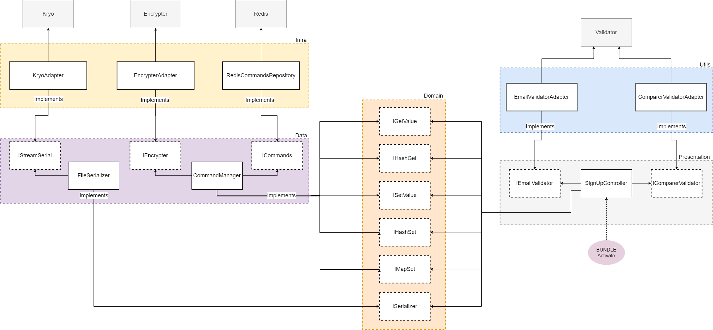

# System Design based on Domain-driver Design and Clean Architecture


<p align="center"> System design of current example </p>

See more in [Domain-driven Design](https://www.amazon.com.br/Domain-driven-Design-Eric-Evans/dp/8576085046).

# Dependency management and Maven submodules
A Maven module is a sub-project. To create a Maven module you will need to **already have** a Maven project available.

The parent project **must have its Packaging option pre-configured to pom, for a module to be created and associated with it**. To ensure your parent project has this option set correctly before proceeding, double-click on the pom.xml file of your parent project in the Project Explorer.

## Parent Maven project
POM file:
```xml
    ...

	<groupId>br.com.quickstart.karaf-redis</groupId>
	<artifactId>karaf-redis</artifactId>
	<version>0.0.1-SNAPSHOT</version>

	<packaging>pom</packaging>
	<name>QUICKSTART :: KARAF-REDIS</name>

    <modules>
		<module>utils</module>
		<module>presentation</module>
		<module>domain</module>
		<module>data</module>
		<module>infra</module>
		<module>features</module>
	</modules>
```

## Utils child Maven sub-project
POM file:
```xml
    ...

	<parent>
		<groupId>br.com.quickstart.karaf-redis</groupId>
		<artifactId>karaf-redis</artifactId>
		<version>0.0.1-SNAPSHOT</version>
	</parent>

	<artifactId>utils</artifactId>
	<name>QUICKSTART :: KARAF-REDIS :: UTILS</name>
	<packaging>bundle</packaging>

	<dependencies>
		<dependency>
			<groupId>br.com.quickstart.karaf-redis</groupId>
			<artifactId>presentation</artifactId>
			<version>${project.version}</version>
			<scope>provided</scope>
		</dependency>
	</dependencies>
```

## Presentation child Maven sub-project
POM file:
```xml
    ...

	<parent>
		<groupId>br.com.quickstart.karaf-redis</groupId>
		<artifactId>karaf-redis</artifactId>
		<version>0.0.1-SNAPSHOT</version>
	</parent>

	<artifactId>presentation</artifactId>
	<name>QUICKSTART :: KARAF-REDIS :: PRESENTATION</name>
	<packaging>bundle</packaging>

	<dependencies>
		<dependency>
			<groupId>br.com.quickstart.karaf-redis</groupId>
			<artifactId>domain</artifactId>
			<version>${project.version}</version>
			<scope>provided</scope>
		</dependency>
	</dependencies>
```

## Domain child Maven sub-project
POM file:
```xml
    ...

	<parent>
		<groupId>br.com.quickstart.karaf-redis</groupId>
		<artifactId>karaf-redis</artifactId>
		<version>0.0.1-SNAPSHOT</version>
	</parent>
	
	<artifactId>domain</artifactId>
	<name>QUICKSTART :: KARAF-REDIS :: DOMAIN</name>
	<packaging>bundle</packaging>
```

## Data child Maven sub-project
POM file:
```xml
    ...

	<parent>
		<groupId>br.com.quickstart.karaf-redis</groupId>
		<artifactId>karaf-redis</artifactId>
		<version>0.0.1-SNAPSHOT</version>
	</parent>

	<artifactId>data</artifactId>
	<name>QUICKSTART :: KARAF-REDIS :: DATA</name>
	<packaging>bundle</packaging>

	<dependencies>
		<dependency>
			<groupId>br.com.quickstart.karaf-redis</groupId>
			<artifactId>domain</artifactId>
			<version>${project.version}</version>
			<scope>provided</scope>
		</dependency>
	</dependencies>
```

## Infra child Maven sub-project
POM file:
```xml
    ...

    <parent>
		<groupId>br.com.quickstart.karaf-redis</groupId>
		<artifactId>karaf-redis</artifactId>
		<version>0.0.1-SNAPSHOT</version>
	</parent>
	
	<artifactId>infra</artifactId>
	<name>QUICKSTART :: KARAF-REDIS :: INFRA</name>
	<packaging>bundle</packaging>
	
	<properties>
		<lib.lettuce.version>5.3.2.RELEASE</lib.lettuce.version>
	</properties>

	<dependencies>
		<dependency>
			<groupId>io.lettuce</groupId>
			<artifactId>lettuce-core</artifactId>
			<version>${lib.lettuce.version}</version>
			<scope>provided</scope>
		</dependency>
		<dependency>
			<groupId>br.com.quickstart.karaf-redis</groupId>
			<artifactId>data</artifactId>
			<version>${project.version}</version>
			<scope>provided</scope>
		</dependency>
	</dependencies>
```

# Features child Maven sub-project
POM file:
```xml
    ...

	<parent>
		<groupId>br.com.quickstart.karaf-redis</groupId>
		<artifactId>karaf-redis</artifactId>
		<version>0.0.1-SNAPSHOT</version>
	</parent>

	<artifactId>features</artifactId>
	<name>QUICKSTART :: KARAF-REDIS :: FEATURES</name>
	<packaging>pom</packaging>

	<build>
		<resources>
			<resource>
				<directory>src/main/feature</directory>
				<filtering>true</filtering>
				<targetPath>${project.build.directory}/feature</targetPath>
			</resource>
		</resources>
		<plugins>
			<plugin>
				<groupId>org.apache.maven.plugins</groupId>
				<artifactId>maven-resources-plugin</artifactId>
				<executions>
					<execution>
						<goals>
							<goal>resources</goal>
						</goals>
					</execution>
				</executions>
			</plugin>
			<plugin>
				<groupId>org.codehaus.mojo</groupId>
				<artifactId>build-helper-maven-plugin</artifactId>
				<version>3.2.0</version>
				<executions>
					<execution>
						<id>attach-artifacts</id>
						<phase>package</phase>
						<goals>
							<goal>attach-artifact</goal>
						</goals>
						<configuration>
							<artifacts>
								<artifact>
									<file>target/feature/feature.xml</file>
									<type>xml</type>
								</artifact>
							</artifacts>
						</configuration>
					</execution>
				</executions>
			</plugin>
		</plugins>
	</build>
```

[Back to main folder](/../../tree/main)