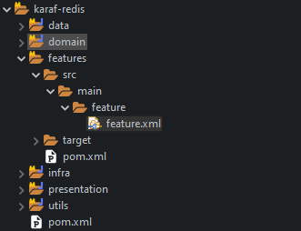
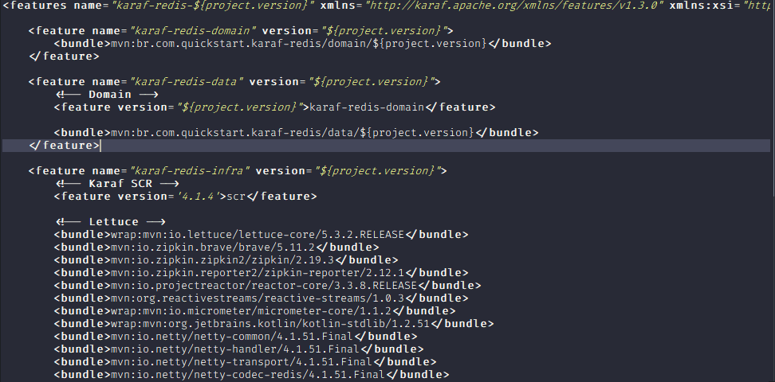

# Apache Karaf - Quickstart

## Overview
Apache Karaf is a modern polymorphic application **container**.

With this flexibility, Karaf is the **perfect solution** for microservices, systems integration, big data, and much more.

Apache Karaf is **powered by OSGi** (but you don’t need to know what OSGi is to use Karaf).

## Prerequisites
Karaf requires a Java SE 8 or higher to run. Refer to http://www.oracle.com/technetwork/java/javase/ for details on how to download and install Java SE 1.8 or greater.

Open a Web browser and access the following URL: http://karaf.apache.org/download.html
1. Download the binary distribution that matches your system (zip for windows, tar.gz for
unixes)
2. Extract the archive to a new folder on your hard drive; for example in c:\karaf - from now on
this directory will be referenced as <KARAF_HOME>.

- To start the server, run the following command in Windows:
```bin\karaf.bat```
- respectively on Unix:
```bin/karaf```

You should see the following information on the command line console:

```
     __ __                 _____
    / //_/____ __________ /  __/
   / ,< / __ `/ ___/ __ `/  /_
  / /| |/ /_/ / / / /_/ / __ /
 /_/ |_|\__,_/_/ \__,_/_/
Apache Karaf (4.2.0)
Hit '<tab>' for a list of available commands
and '[cmd] --help' for help on a specific command.
Hit '<ctrl-d>' or type 'system:shutdown' or 'logout' to shutdown Karaf.
karaf@root()>
```

## Feature repositories
The features are described in a features XML descriptor. This XML file contains the description of a set of features.

A features XML descriptor is named a "features repository". Before being able to install a feature, you have to register the features repository that provides the feature (using feature:repo-add command)


<p align="center"> Feature of current example </p>


<p align="center"> XML Feature file </p>

## Feature Install
The ```feature:install``` command installs a feature.

It requires the feature argument. The feature argument is the name of the feature, or the name/version of the feature. If only the name of the feature is provided (not the version), the latest version available will be installed.

```
    karaf@root()> feature:install karaf-redis-domain
```

See more in [Apache Karaf Container 4.x - Documentation](https://downloads.apache.org/karaf/documentation/4_x.pdf).

[Back to main folder](/../../tree/main)