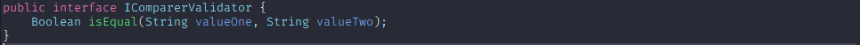
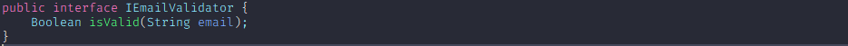
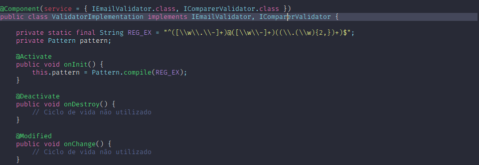
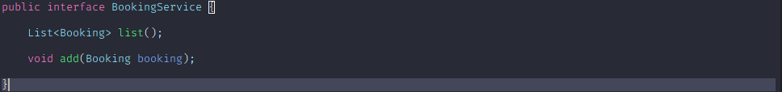
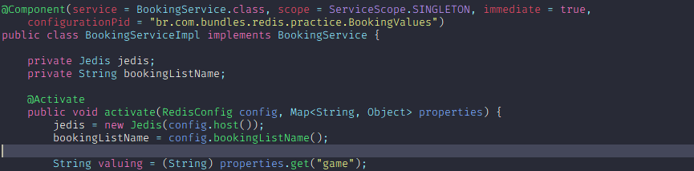
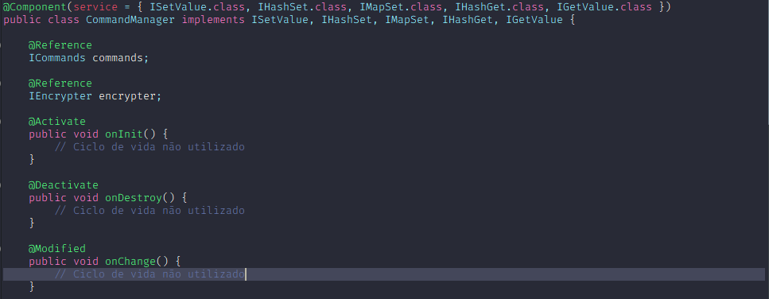

# OSGi - Key Explanation
Some concepts of the OSGi framework are very important, and one of them is the **Declarative Service Specification**, which is one of the recurring specifications in this example.

# Dealing with Increasing Complexity
Why is it difficult to maintain a large code base over many years? Many projects get into more and more problems as soon as the code base becomes larger. The core of **the problem is that the code is not modular**: there is no clear separation between different parts of the code base.

This can be improved by identifying separate parts of a system and strictly separating them from other parts of the code. Doing so starts with one of the most basic object orientation best practices: **program to interfaces, not to implementations**. By programming to interfaces only, you can **make changes** to implementations without breaking consumers of the interface.

See more in [S.O.L.I.D Principles](https://www.baeldung.com/solid-principles).

See more in [Building Modular Cloud Apps with OSGi: Practical Modularity with Java in the Cloud Age](https://www.amazon.com/Building-Modular-Cloud-Apps-OSGi/dp/1449345158).

# OSGi Framework Overview
The Framework forms the core of the OSGi Specifications. It provides a **general-purpose, secure, and managed Java framework** that supports the deployment of extensible and downloadable applications known as bundles.

OSGi-compliant devices can download and install OSGi bundles, and remove them when they are no longer required. The Framework manages the installation and update of bundles in an OSGi environment in a dynamic and scalable fashion. To achieve this, it manages the dependencies between bundles and services in detail.

See more in [OSGi Core](https://docs.osgi.org/download/r6/osgi.core-6.0.0.pdf).

# Declarative Service Specification
The OSGi Framework contains a procedural service model which **provides a publish/find/bind model for using services**. This model is elegant and powerful, it enables the building of applications outof bundles that communicate and collaborate using these services.

This specification addresses some of the complications that arise when the OSGi service model is used for larger systems and wider deployments, such as:

1. **Startup Time** - The procedural service model requires a bundle to actively register and acquire its services.
2. **Memory Footprint** - A service registered with the Framework implies that the implementation, and related classes and objects, are loaded in memory.
3. **Complexity** - Service can come and go at any time. This dynamic behavior makes the service programming model more complex than more traditional models.

## SCR - Service Component Runtime
The Service Component Runtime reads component descriptions from started bundles. These descriptions are in the form of XML documents which define a set of components for a bundle. After a component configuration becomes satisfied, a number of different scenarios can take place depending on the component type:

1. **Immediate Component** - The component configuration of an immediate component must be **activated immediately after becoming satisfied**. Immediate components may provide a service.
2. **Delayed Component** - When a component configuration of a delayed component becomes satisfied, SCR will register the service specified by the service element without activating the component configuration.
    1. **Requested**: **SCR must activate the component configuration** creating an instance of the component implementation class that will be returned as the service object. 
    2. **Bundle**: **For each distinct bundle** that requests the service object, a **different component configuration is created and activated and a new instance of the component implementation class is returned as the service object. 
    3. **Prototype**: **For each distinct request** for the service object, such as via ServiceObjects, a different component configuration is created and activated and a new instance of the component implementation class is returned as the service object.
3. **Factory Component** - If a component's description specifies the factory attribute of the component element, **SCR will register a Component Factory** service. This service allows client bundles to create and activate multiple component configurations and dispose of them. If the component's description also specifies a service element, then as each component configuration is activated, SCR will register it as a service.

## Annotations
A number of CLASS retention annotations have been provided to allow tools to construct the component description XML from the Java class files. For example, the **@Component** annotation synthesizes the implement element's class attribute from the type it is applied to.

### Component Annotations
The Component Annotations provide a convenient way to create the component description XML during build time. Since annotations are placed in the source file and can use types, fields, and methods, they can significantly simplify the use of Declarative Services.
#### The Component Annotations are not inherited, they can only be used on a given class, annotations on its super class hierarchy or interfaces are not taken into account.

## Primary Annotation: @Component
It indicates that a class is a component. Its defaults create the easiest to use component:

1. Its name is the class name.
2. It registers all of the class's directly implemented interfaces as services.
3. The instance will be shared by all bundles.
4. It is enabled.
5. It is immediate if it has no services, otherwise it is delayed.
6. It has an optional configuration policy.
7. The configuration PID is the class name.

```
Identify the annotated class as a Service Component.
The annotated class is the implementation class of the Component.
```

## Example 1:
The following class registers an IEmailValidator and IComparerValidator service: 

- Note: If the component wants to be updated for changes in the configuration properties than it can also indicated the modified method with the Modified annotation.


<p align="center"> IEmailValidator - Interface </p>

<p align="center"> IComparerValidator - Interface </p>

<p align="center"> Validator Implementation - Register </p>

- Property: Class<?>[] **service** default {}:
```
1. The types under which to register this Component as a service.
2. If no service should be registered, the empty value {} must be specified.
3. If not specified, the service types for this Component are all the directly implemented interfaces of the class being annotated.
```

## Example 2:
The following class registers an Booking service:


<p align="center"> BookingService - Interface </p>

<p align="center"> BookingServiceImpl - Register </p>

- Property: boolean **immediate** default false:
```
1. Declares whether this Component must be immediately activated upon becoming satisfied or whether activation should be delayed.
2. If true, this Component must be immediately activated upon becoming satisfied. If false, activation of this Component is delayed. If this property is specified, its value must be false if the factory() property is also specified or must be true if the service() property is specified with an empty value.
3. If not specified, the default is false if the factory() property is specified or the service() property is not specified or specified with a non-empty value and true otherwise.
```

- Property: String[] **configurationPid** default "$":
```
1. The configuration PIDs for the configuration of this Component.
2. Each value specifies a configuration PID for this Component.
3. If no value is specified, the name of this Component is used as the configuration PID of this Component.
4. A special string ("$") can be used to specify the name of the component as a configuration PID. The NAME constant holds this special string. For example:
    @Component(configurationPid={"com.acme.system", Component.NAME})
5. Tools creating a Component Description from this annotation must replace the special string with the actual name of this Component.
```

- Property: ServiceScope **scope** default DEFAULT:
```
1. The service scope for the service of this Component.
2. If not specified, the singleton service scope is used. If the factory() element is specified or the immediate() element is specified with true, this element can only be specified with the singleton service scope.
```

### Secundary Annotations: @Activate
**@Activate**: Identify the annotated method as the *activate* method of a Service Component.
1. The annotated method is the activate method of the Component.
2. This annotation is not processed at runtime by Service Component Runtime. It must be processed by tools and used to add a Component Description to the bundle.

See Also: The activate attribute of the component element of a Component Description.

Retention: CLASS

Target: METHOD

### Secundary Annotations: @Deactivate
**@Deactivate**: Identify the annotated method as the *deactivate* method of a Service Component.
1. The annotated method is the deactivate method of the Component.
2. This annotation is not processed at runtime by Service Component Runtime. It must be processed by tools and used to add a Component Description to the bundle.

See Also: The deactivate attribute of the component element of a Component Description.

Retention: CLASS

Target: METHOD

### Secundary Annotations: @Modified
**@Modified**: Identify the annotated method as the *modified* method of a Service Component.
1. The annotated method is the modified method of the Component.
2. This annotation is not processed at runtime by Service Component Runtime. It must be processed by tools and used to add a Component Description to the bundle.

See Also: The modified attribute of the component element of a Component Description.

Retention: CLASS

Target: METHOD

## Secundady Annotations: @Reference
If a component has dependencies on other services then they can be referenced with the Reference annotation that can be applied to a bind method or a field. For a field, the defaults for the Reference annotation are:

1. The name of the bind method or field is used for the name of the reference.
2. 1:1 cardinality if the field is not a collection. 0..n cardinality if the field is a collection.
3. Static reluctant policy if the field is not declared volatile. Dynamic reluctant policy if the field is declared volatile.
4. The requested service is the type of the field.

## Example 3:
The following class Reference to ICommand and IEncrypter services:

<p align="center"> Reference - Annotation </p>

**@Reference**: Identify the annotated member as a reference of a Service Component.

1. When the annotation is applied to a method, the method is the bind method of the reference. When the annotation is applied to a field, the field will contain the bound service(s) of the reference.
2. This annotation is not processed at runtime by Service Component Runtime. It must be processed by tools and used to add a Component Description to the bundle.
3. In the generated Component Description for a component, the references must be ordered in ascending lexicographical order (using String.compareTo ) of the reference names.

See Also: The reference element of a Component Description.

Retention: CLASS

Target: METHOD, FIELD

See more in [OSGi Compendium](https://docs.osgi.org/download/r6/osgi.cmpn-6.0.0.pdf).

[Back to main folder](/../../tree/main)