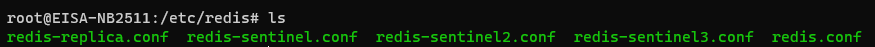
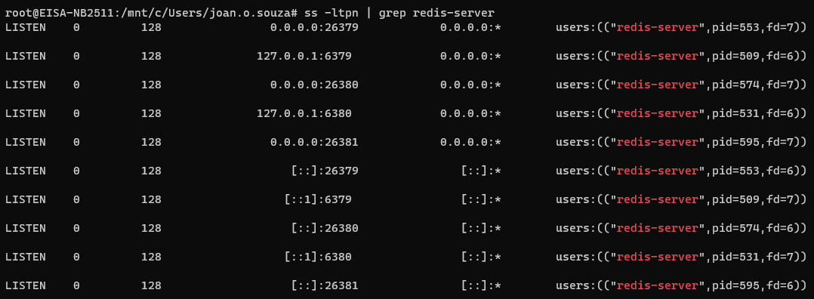

# Local environment
Some details of this session may not be according to your local configuration, due to differences in operating systems. This example was developed on a Windows 10 operating system, with the Linux subsystem enabled ([WSL Configuration](https://docs.microsoft.com/pt-br/windows/wsl/install-win10)).

Obs. All steps are the same regardless of the operating system, just pay attention to where the files are stored.

# Redis Configuration
To use Sentinel in our local we need to do some configurations. First, we need a replica and three sentinel instances. For this quickstart example, I will have one master node, one replica, and three sentinel instances. In this section, I will explain all of the configuration processes.

## Replica configuration
For configuration of Redis Replica open Redis configuration file. We will use the master configuration file, make necessary changes for the replica, and save it as a replica file. In my computer config file path of the master is: (On WSL terminal).

``` /etc/redis/redis.conf ```


<p align="center"> Redis path </p>

- Note: At this configuration point, you will only have the 'redis.conf' file.

When you open the config file you can see that the default port for Redis master is 6379. To define a replica node change port to be 6380 and look for replicaof which will be commented out.

```
port 6379
# replicaof <masterip> <masterport>
```

In **replicaof**, we need to give our master IP and port which is running on localhost and port 6379. Save this file as ```redis-replica.conf```.

```
port 6380
replicaof 127.0.0.1 6379
```

## Sentinel Configuration
The default port for Sentinel is 26379, so for sentinel instance to work, port 26379 of your servers must be open to receive connections from the IP addresses of the other sentinel instances. Otherwise, these instances can’t talk and agree about what to do, so failover will never be performed.

You can configure the time required to check the master is down or not. Find down-after-milliseconds command which is the time in milliseconds to an instance should not be reachable for a Sentinel starting to think it is down. The default value is 30000 ms and you can change it as you like.

- Note: The sentry configuration file can be obtained from the Redis website. If you can't find them, in this repository location there is a file named 'redis-sentinel.conf', you can use this as a starting point, but take note that it will already be configured.

```
sentinel down-after-milliseconds mymaster 10000
```

### Sentinel Important Concepts
Sentinel has two concepts of being down. **Subjectively Down** (SDOWN) condition is the local sentinel instance node thinks that Master is down. **Objectively Down** (ODOWN) condition is if enough instances (when quorum met) agree that the Master is not reachable.

Steps:
1. Each Sentinel detects the master is down with an +sdown event;
2. This event is later escalated to +odown, which means that multiple Sentinels agree about the fact the master is not reachable;
3. Sentinels vote a Sentinel that will start the first failover attempt;
4. The failover happens;

Configure Sentinel to observe the Master with a specified quorum number.

```
# sentinel monitor <master-group-name> <ip> <port> <quorum>
sentinel monitor mymaster 127.0.0.1 6379 2
```

Configure the second and third sentinel by changing ports and save as different sentinel files.

```
port 26380
port 26381
```

As a result, i have one Master node, one replica, and three Sentinels:

<p align="center"> Redis final folder </p>

# Starting nodes
## They must be applied to different terminals!
- Terminal 1:
```
redis-server /etc/redis/redis.conf
```
- Terminal 2:
```
redis-server /etc/redis/redis-replica.conf
```

You can check running ports and if the master and replica are synced or not:

```
ss -ltpn | grep redis-server
```

We also need to run our sentinel instances. You can run Sentinel instances by this command:

```
redis-sentinel /path/to/redis-sentinel*.conf
```
- Note: redis-sentinel* -> Reference to each sentinel, which must also be started at different terminals.


<p align="center"> Redis-Server Listen </p>

I will use Redis CLI to connect all nodes and use commands to get information or stored data. Let’s connect to a Sentinel and get info about our master and configurations.

```
redis-cli -p 26379
SENTINEL masters
```

Observe the settings of: Master, Running Port, Down Seconds, Number of Replicas, Quorum configuration.

## Failure case:
Now let’s see what is the behavior of sentinel instances in case of master failure by killing the master node.

Shutdown the master:
```
sudo fuser -n tcp -k 6379
```

After killing the master we can see that replica loses connection with the master. Sentinel instances go to sdown condition then quorum is met and odown condition is reached. The failover is started after 10 seconds since that is my configuration and after failover, the replica is promoted to be master.

This statement can be validated with the SENTINEL masters command and verifying that the master's IP is no longer 6379, but 6380.

