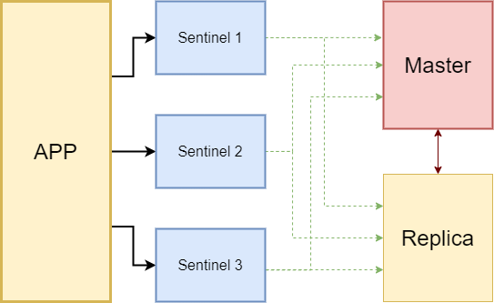

# High availability system
Computing environments configured to provide nearly full-time availability are known as [high availability](https://docs.oracle.com/cd/A91202_01/901_doc/rac.901/a89867/pshavdtl.htm#:~:text=Computing%20environments%20configured%20to%20provide,single%20points%2Dof%2Dfailure) systems. Such systems typically have redundant hardware and software that makes the system available despite failures. Well-designed high availability systems avoid having single points-of-failure.

# Redis
Redis is an open source (BSD licensed), in-memory data structure store, used as a database, cache and message broker. It supports data structures such as strings, hashes, lists, sets, sorted sets with range queries, bitmaps, hyperloglogs, geospatial indexes with radius queries and streams.

# Redis Sentinel
# What is it?
Redis Sentinel  is the high availability solution of Redis. In practical terms this means that using Sentinel you can create a Redis deployment that resists without human intervention certain kinds of failures. 

It provides this by providing 4 things:
- Monitoring
- Notification
- Automatic failover
- Configuration provider

Thus, Sentinel constantly checks that the master and replica instances are working as expected. If a master is not performing as expected, Sentinel can initiate a failover process in which one replica is promoted to master.

Sentinel acts as a source of authority for discovering customer services: customers connect to Sentinels to request the address of the current Redis master responsible for a particular service. If a failover occurs, Sentinels will report the new address.

# Fundamentals of Redis Sentinel
The Sentinel documentation states that at least three sentinel instances are required for robust deployment. Although they can run as parallel processes in the same Redis instance, they should be placed into servers or VMs that are believed to fail independently.

Sentinel constantly checks the master for a failure. If enough sentinel agrees that the master is down then it acts as an authority and will start a failover process. As a result, it will promote a replica to be the master, configure other replicas to use new master until the master node is reachable again.

Sentinel agreement depends on the quorum value. Quorum value is the minimum number of the sentinels agree that the master is not reachable now. For 3 sentinel instances, the usual quorum value is 2.

See more in [Redis Sentinel](https://redis.io/topics/sentinel).
 
Example using [Spring framework](https://medium.com/trendyol-tech/high-availability-with-redis-sentinel-and-spring-lettuce-client-9da40525fc82)
 

